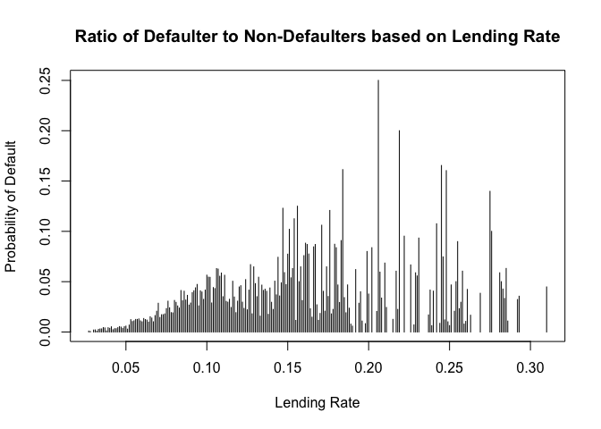
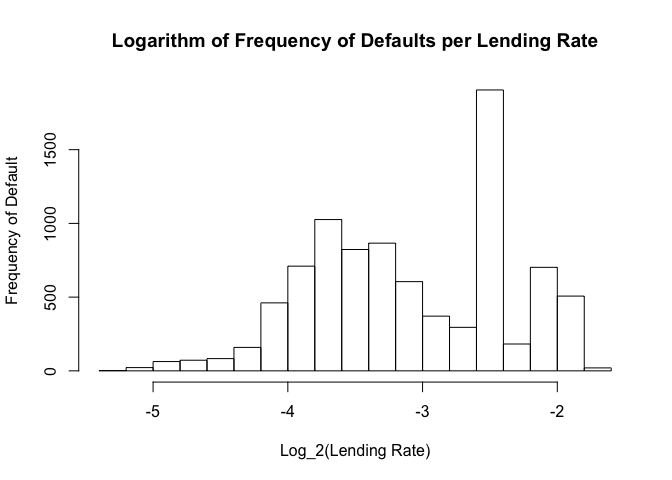
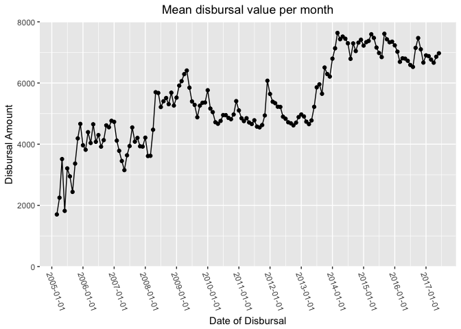
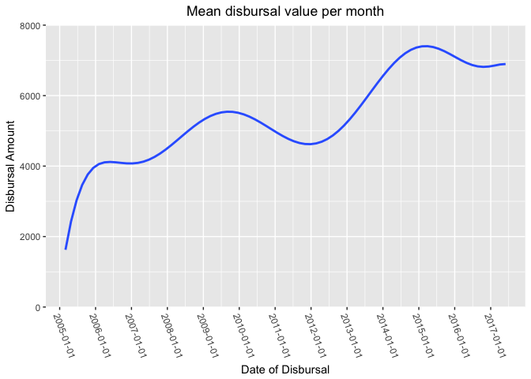

### Jordan Pears R Practice

Default Probability Analysis
============================

I focussed on the Zopa loanbook for my first analysis and maintained simplicity by simply analysing the fairly intuitive relationship between increased interest rate and increased default rate.

``` r
zopa <- read.csv(paste(getwd(),"/zopa.csv",sep = ""), header = TRUE)
zopa_default <- subset(zopa,select = c("Lending.rate","Date.of.Default"))
zopa_default <- subset(zopa_default,subset = zopa_default$Date.of.Default != "")
zopa_default$Date.of.Default <- sapply(zopa_default$Date.of.Default,function(x){x=1})
zopa_all <- subset(zopa,select = c("Lending.rate","Date.of.Default")) 
zopa_all$Date.of.Default <- sapply(zopa_all$Date.of.Default,function(x){if (x != ""){x=1} else if (x == ""){x=0}})
```

The above is some data importing and munging to get into easy to use formats and subset into defaulted information and lending rate information only.

Below I am taking the data frames of defaulted loans and all loans and rounding them to 3 decimal places to they they are somewhat categorical instead of continuous, and then putting them into a table that I then convert back into a data.frame object for future usage.

``` r
zopa_all <- as.data.frame(table(round(zopa_all$Lending.rate,3))) 
zopa_default <- as.data.frame(table(round(zopa_default$Lending.rate,3))) 
```

I now am creating a list of indicies of which the zopa\_default loan rate matches up with the zopa\_all loan rates. note: I suspect there is a much nicer way to do this, but I couldn't find it.

``` r
zopa_indicies <- match(zopa_default$Var1,zopa_all$Var1)
```

Now I am defining my own function to create a table of lending rates and their respective default proportions and returning that table. Again, I suspect there is an easier way to do this.

``` r
getProportions <- function(def,nondeflist,indexlist){ #function to get the relative proportions to default/notdefault for each lending rate
  proportions <- def
  for (i in 1:length(def$Freq)){
    proportions$Freq[i] <- def$Freq[i]/nondeflist[indexlist[i]]
  }
  return(proportions)
}
```

Calling this and subsequently plotting it will give us a nice graph of lending rate to default probability, the dataset is somewhat small at only ~8800 defaults occuring and I imagine that accounts for the instability at higher levels as lower loans are given to higher levels.

``` r
proportions <- getProportions(zopa_default,zopa_all$Freq,zopa_indicies)

propmatrix <- as.matrix(proportions) #data type confusion
propmatrix[,1] <- as.numeric(propmatrix[,1])
propmatrix[,2] <- as.numeric(propmatrix[,2])
plot(propmatrix, type = "h", xlab = "Lending Rate", ylab = "Probability of Default", main = "Ratio of Defaulter to Non-Defaulters based on Lending Rate")
```



After completed this analysis I explored further how I could do this easier, and discovered I could have skipped all the fluff above and simply applied a logarhmic scale onto a freqeuncy histogram of a table of defaulting customers and their lending rates.

``` r
hist(log(zopa_default$Lending.rate,2), xlab = "Log_2(Lending Rate)", ylab = "Frequency of Default", main = "Logarithm of Frequency of Defaults per Lending Rate")
```



Loan Value Analysis
===================

After this analysis I have decided to play around with graphs some more and try plotting the disbursal value per month (so the average amount given out to borrowers per month) to see the expected increase due to economic strength and inflation. For this analysis I have chosen to use the tidyverse composite package, of which I have used ggplot2 and lubridate.

``` r
library(tidyverse)
```

Starting by subsetting my main zopa dataset keeping only the fields "Original.Loan.Amount" and "Disbursal.date", I then sorted the data by date in ascending order and converted the date column into a date type using ymd() in lubridate which converts strings to y-m-d date format.

``` r
zopa_date_amount <- subset(zopa,select = c(Original.Loan.Amount,Disbursal.date))
zopa_date_amount <- zopa_date_amount[order(zopa_date_amount$Disbursal.date),] 
zopa_date_amount$Disbursal.date<-lubridate::ymd(zopa_date_amount$Disbursal.date)
```

I now need to aggregate my data as it is currently records of each loan and the date it was dipersed, I want to aggregate the data into monthly chunks and then work out the mean loan for that month so that it can be plotted into a time series line-graph. I rounded down the month to the 1st of each month for simplicity and created another column in my zopa\_date data.frame which had the corresponding year-month for each loan, then aggregated and averaged each monthly block. I put this into a new data.table and appropriately named the columns.

``` r
zopa_date_amount$month <- lubridate::floor_date(zopa_date_amount$Disbursal.date,"month")
zopa_aggregate <- aggregate(x = zopa_date_amount$Original.Loan.Amount, by = list(zopa_date_amount$month),FUN = mean)
names(zopa_aggregate) <- c("DisbursalDate", "OriginalLoanAmount")
```

I now simply plot the graph, I tweaked lots of ggplot2 settings to achieve an aesthetically pleasing plot that is easy to understand.

``` r
ggplot(data = zopa_aggregate, aes(x=DisbursalDate, y = OriginalLoanAmount)) + 
  geom_line() +
  geom_point() +
  expand_limits(y=0) +
  scale_x_date(expand = c(0,200),breaks = pretty(zopa_aggregate$DisbursalDate, n = 10)) + scale_y_continuous(expand=c(0,0),limits = c(0,8000)) +
  xlab("Date of Disbursal") + ylab("Disbursal Amount")+
  ggtitle("Mean disbursal value per month") +
  theme(plot.title = element_text(hjust = 0.5),axis.text.x = element_text(angle = 290,hjust =0))
```



I also created another plot with the inclusion of the below code chunk that is easier to interpret and share with less mathematical audiences.

``` r
stat_smooth(method = "lm", formula = y ~ poly(x, 9), size = 1,se=FALSE)
```


